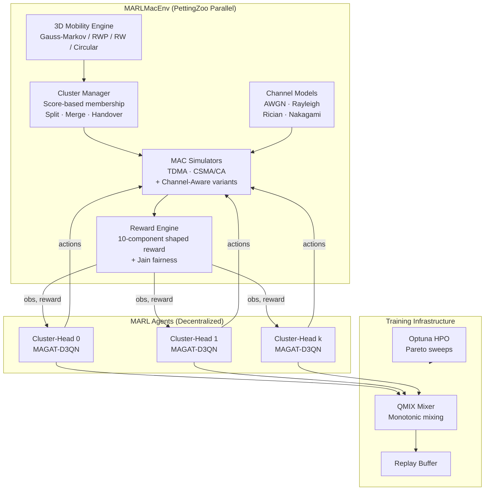
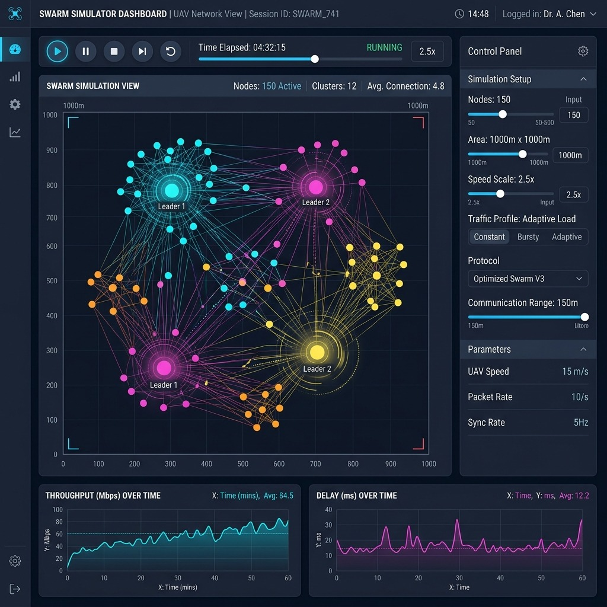

<p align="center">
  
</p>

<h1 align="center">D3QN-FANET: Decentralized Multi-Agent Deep RL for Adaptive MAC in Flying Ad-Hoc Networks</h1>

<p align="center">
  <em>Multi-Agent Graph Attention Dueling Double-Deep Q-Networks for dynamic cluster-based MAC protocol selection and burst-split scheduling in UAV swarms.</em>
</p>

<p align="center">
  
  
  
  
  
</p>

---

## Table of Contents

- [Overview](#overview)
- [How It Works](#how-it-works)
- [Architecture Diagram](#architecture-diagram)
- [Live Simulator UI](#live-simulator-ui)
- [Project Structure](#project-structure)
- [Getting Started](#getting-started)
- [Training Agents](#training-agents)
- [Experiment Suites](#experiment-suites)
- [Configuration Reference](#configuration-reference)
- [Results & Outputs](#results--outputs)
- [Citation](#citation)

---

## Overview

In Flying Ad-Hoc Networks (FANETs), UAVs must dynamically select Medium Access Control (MAC) protocols (TDMA vs. CSMA/CA) and allocate burst-time between intra-cluster communication and inter-cluster coordination — all without a central controller.

This repository implements a **Decentralized Multi-Agent Reinforcement Learning (MARL)** framework where each cluster-head UAV is an independent agent that:

1. **Observes** its local cluster state (queue levels, collision rates, mobility, neighbour topology)
2. **Decides** a joint action `a_k(t) = (MAC mode, burst-split ratio ρ)`
3. **Receives** a shaped reward balancing throughput, delay, collisions, energy, and coordination quality

The flagship model — **MAGAT-D3QN** (Multi-Agent Graph ATtention Dueling Double-Deep Q-Network) — uses Graph Attention Networks (GAT) to learn topology-aware cooperation across the dynamic cluster interference graph, combined with GRU temporal memory and a dueling Q-value architecture.

### Key Features

| Capability | Description |
|---|---|
| **Decentralized CTDE** | Centralised Training, Decentralised Execution via QMIX / VDN / IQL / MAGAT-D3QN |
| **Dynamic Clustering** | Score-based membership with hysteresis, split/merge, leader health & handover |
| **Burst-Split Control** | Each cluster-head tunes `ρ_k(t)` to balance intra-cluster (T₁) vs. inter-cluster (T₂) time |
| **3D Mobility** | Gauss–Markov, Random Waypoint, Random Walk, Circular/Spiral models with variable speed |
| **Channel Fading** | Optional Rayleigh, Rician, Nakagami-m, and AWGN channel models with BER-driven packet success |
| **Live Visualization** | Real-time browser-based simulator with WebSocket streaming |
| **Experiment Automation** | One-command generalization, robustness, failure/recovery, and Pareto-optimal hyperparameter sweeps |

---

## How It Works

### 1. Environment: Decentralized Cluster-Head Control

The FANET environment (`envs/marl_mac_env.py`) models `N` UAVs organized into up to `C_MAX=10` dynamic clusters. The simulation loop operates in **burst cycles**:

```
┌─────────────────────── One Burst Cycle (t_burst = 0.5s) ───────────────────────┐
│                                                                                 │
│   ┌──── T₁ = ρ·t_burst ────┐  ┌────── T₂ = (1-ρ)·t_burst ──────┐             │
│   │  Intra-Cluster Phase    │  │   Inter-Cluster Coordination    │             │
│   │  • TDMA or CSMA/CA      │  │   • Schedule exchange           │             │
│   │  • Data + control pkts  │  │   • Relay forwarding            │             │
│   │  • Local MAC simulation │  │   • Topology updates            │             │
│   └─────────────────────────┘  └─────────────────────────────────┘             │
└─────────────────────────────────────────────────────────────────────────────────┘
```

Each active cluster-head agent selects:
- **MAC mode** `m_k ∈ {TDMA, CSMA/CA}` — which protocol to run inside its cluster during T₁
- **Burst-split ratio** `ρ_k ∈ {0.1, 0.2, ..., 0.9}` — how much of the burst to allocate to local service vs. inter-cluster coordination

### 2. Observation Space (per cluster-head, dim = 24)

Each cluster-head observes a 24-dimensional vector encoding:

| Dims | Feature | Description |
|---|---|---|
| 0–2 | Position (x, y, z) | Normalized leader position |
| 3–5 | Velocity (vx, vy, vz) | Normalized leader velocity |
| 6 | Cluster size | `|C_k| / N_MAX` |
| 7 | Queue occupancy | `Σ queues / (|C_k| × QMAX)` |
| 8 | Collision rate | Recent intra-cluster collision ratio |
| 9 | Energy | Normalized residual energy |
| 10 | Interference degree | Neighbours in R_I / (C_MAX − 1) |
| 11 | Health score | Leader health `H_u(t)` |
| 12–13 | Demand signals | Local-ctrl demand, coordination backlog |
| 14–15 | Handover info | Handover flag, handover age |
| 16–20 | Neighbour summary | Aggregated stats from neighbouring clusters |
| 21–23 | Burst history | Recent ρ, T₁ utilization, coordination success |

### 3. Reward Function

The per-cluster reward is a weighted combination of 10 normalized components:

```
r_k(t) =  α₁·throughput_local + α₂·throughput_inter
         − β₁·delay_local     − β₂·delay_inter
         − γ·collisions       − δ·energy_cost
         − η·interference     − ψ·coord_failure
         − φ·queue_overflow   − ζ·handover_disruption
```

Team reward adds a Jain's fairness index bonus for equitable throughput distribution across clusters.

### 4. MAGAT-D3QN Architecture

```
Input: Local obs x_k ∈ ℝ²⁴
  │
  ▼
┌──────────────────────────────────────────────────┐
│  GAT Layer 1 (multi-head attention, h=2 heads)   │
│  Learns topology-aware feature embedding          │
│  Aggregates neighbour state via attention weights │
└──────────────────────────────────────────────────┘
  │
  ▼
┌──────────────────────────────────────────────────┐
│  GAT Layer 2 (single-head, output projection)    │
└──────────────────────────────────────────────────┘
  │
  ▼
┌──────────────────────────────────────────────────┐
│  GRU Temporal Memory                              │
│  Persistent hidden state across burst steps       │
│  Captures time-varying traffic & mobility trends  │
└──────────────────────────────────────────────────┘
  │
  ├────────────────┐
  ▼                ▼
┌────────┐   ┌──────────┐
│ V(s)   │   │ A(s, a)  │    Dueling streams
│ Value  │   │ Advantage│
└────────┘   └──────────┘
  │                │
  ▼                ▼
  Q(s, a) = V(s) + [A(s,a) − mean(A)]
```

Training uses **Double DQN** target updates and supports CTDE mixing via:
- **QMIX**: Monotonic mixing with hypernetworks
- **VDN**: Value decomposition (additive)
- **IQL**: Independent Q-learning (no mixing)

### 5. Dynamic Clustering

The `ClusterManager` maintains cluster structure via:

- **Membership score**: `S_{i,k}(t) = w_d·f_dist + w_s·f_sinr + w_m·f_mob + w_q·f_load`
- **Hysteresis**: Move to cluster M only if `Score(M) > θ_join` AND `Score(current) < θ_leave`
- **Split/Merge**: Automatic when cluster size exceeds `N_MAX=12` or drops below `N_MIN=2`
- **Leader health**: `H_u(t) = w₁·energy + w₂·degree + w₃·mobility − w₄·queue − w₅·risk`
- **Handover**: Leader replacement triggered when `H_u(t) < HEALTH_THRESHOLD`

---

## Architecture Diagram



---

## Live Simulator UI

The `simulator_ui/` module provides a **real-time browser-based dashboard** for visualizing and interacting with the decentralized cluster-head environment.

<p align="center">
  
</p>

### What the Dashboard Shows

| Panel | Description |
|---|---|
| **Main Canvas** | Live 2D projection of UAV positions, cluster membership links (member → leader), and the interference graph edges between cluster-heads |
| **Runtime Truth** | Current step, episode time, active cluster count, total throughput, aggregate queue levels, collision count |
| **Base Config** | Tunable simulation parameters — node count (N), area size, offered load (pps), clustering weights, and health thresholds |
| **Environment Controls** | Advanced knobs for mobility model, traffic profile, topology preset, graph corruption, observation staleness/noise, interference scaling, and failure schedules |
| **Policy Selector** | Switch between trained RL checkpoints (MAGAT-D3QN, QMIX, VDN, IQL) and fixed baselines (All-TDMA, All-CSMA). Shows compatibility status and auto-falls back if a checkpoint is incompatible |
| **Preset Library** | One-click scenario presets grouped by study block — Default, Generalization, Robustness, and Failure/Recovery |
| **Charts** | Live throughput, delay, and queue time-series plots |

### How to Launch

```bash
# From the project root
python simulator_ui/server.py
```

Then open **http://localhost:8080** in your browser.

### Controls

| Button | Action |
|---|---|
| ▶ **Run** | Start continuous simulation (auto-stepping) |
| ⏸ **Pause** | Freeze the simulation |
| ⏭ **Step** | Advance exactly one burst cycle |
| 🔄 **Reset** | Re-initialize the environment from scratch |
| ⚡ **Speed** | Adjust simulation playback speed (0.1× to 20×) |
| 📤 **Export** | Save current run data as CSV artifacts |

### Exported Data Files

| File | Contents |
|---|---|
| `mobility_positions.csv` | Per-step UAV positions: `timestamp, uav_id, x, y, z, vx, vy, vz, speed` |
| `cluster_step_records.csv` | Per-step cluster metrics: throughput, delay, queue, collisions, actions |
| `cluster_graph_edges.csv` | Interference graph edges per step |
| `node_cluster_membership.csv` | UAV-to-cluster assignment per step |

### Robustness Testing via the UI

The right-panel **Environment Controls** let you inject impairments in real time:

- **Graph corruption**: Drop edges (`missing_edge_prob`) or add false edges (`false_edge_prob`)
- **Observation staleness**: Delay observations by N steps
- **Observation noise**: Add Gaussian noise to agent observations
- **Failure injection**: Schedule cluster-head failures at specific steps targeting random, max-backlog, or max-degree leaders
- **Traffic profiles**: Switch between smooth Poisson, bursty ON/OFF, and heavy-tail Pareto traffic

---

## Project Structure

```
D3QN_FANET/
│
├── algorithms/                    # Core algorithm implementations
│   ├── mac/                       # MAC protocol simulators
│   │   ├── baseline.py            # TDMA, CSMA/CA, Slotted ALOHA (slot-level)
│   │   └── channel_aware_mac.py   # Fading-aware TDMA/CSMA variants
│   ├── mobility/                  # 3D UAV mobility subsystem
│   │   ├── models.py              # Gauss-Markov, RWP, Random Walk, Circular
│   │   ├── speed.py               # Variable speed engine (4 modes)
│   │   ├── link.py                # Range-gated link + optional path-loss
│   │   ├── manager.py             # MobilityManager orchestrator
│   │   └── plotting.py            # Trajectory & link-up plots
│   ├── channel/                   # RF channel models
│   │   └── fading.py              # AWGN, Rayleigh, Rician, Nakagami-m + BER
│   └── rl/                        # Reinforcement learning agents
│       ├── gnn_marl.py            # MAGAT-D3QN Q-network + QMIX mixer
│       ├── marl_baselines.py      # IQL, VDN, QMIX training loops
│       ├── mappo_agent.py         # MAPPO agent (policy gradient baseline)
│       ├── qlearning_selector.py  # Tabular + deep Q-learning selector
│       ├── rewards.py             # Shaped reward function
│       └── sb3_baselines.py       # Stable-Baselines3 wrappers (PPO, A2C, DQN)
│
├── envs/                          # Gymnasium / PettingZoo environments
│   ├── marl_mac_env.py            # Main MARL environment (PettingZoo Parallel)
│   ├── clustering.py              # ClusterManager (membership, split/merge, handover)
│   ├── burst_scheduler.py         # Burst-split action encoding/decoding
│   ├── sarl_mac_env.py            # Single-agent RL wrapper
│   └── sarl_central_env.py        # Centralized SARL environment
│
├── configs/                       # Configuration files
│   ├── config.py                  # Global simulation parameters
│   ├── cluster_config.py          # Clustering + reward coefficients
│   ├── marl_config.py             # MARL hyperparameters
│   └── *.json                     # Scale-specific configs (N=20..5000)
│
├── experiments/                   # Experiment runners & analysis
│   ├── run_unified_experiment.py  # Main training + evaluation pipeline
│   ├── run_generalization_suite.py
│   ├── run_robustness_suite.py
│   ├── run_failure_recovery_suite.py
│   ├── run_pareto_optuna.py       # Multi-objective hyperparameter optimization
│   ├── run_fading_ablation.py     # Channel fading ablation study
│   └── generate_pareto_figures.py # Publication-quality plots
│
├── simulator_ui/                  # Real-time browser visualization
│   ├── server.py                  # WebSocket + HTTP server
│   ├── engine.py                  # Simulation engine (wraps MARLMacEnv)
│   └── static/                    # Frontend (HTML/CSS/JS)
│       ├── index.html
│       ├── css/style.css
│       └── js/
│           ├── main.js            # App entry point
│           ├── scene.js           # Canvas rendering (UAVs, links, clusters)
│           ├── panels.js          # Config panels & controls
│           ├── charts.js          # Live time-series charts
│           └── ws.js              # WebSocket client
│
├── tests/                         # Test suites
│   ├── smoke/                     # Quick sanity checks
│   ├── functional/                # Feature-level tests
│   ├── integration/               # End-to-end pipeline tests
│   ├── regression/                # Regression guards
│   └── test_clustering.py         # Cluster manager tests
│
├── diagrams/                      # Architecture diagrams (draw.io, scripts)
├── shell_runners/                 # Bash scripts for pipeline orchestration
├── docs/                          # Documentation & CSV schema reference
├── demo.gif                       # Animated demo of the simulator
├── requirements.txt               # Python dependencies
└── README.md                      # This file
```

---

## Getting Started

### Prerequisites

- **Python 3.10+**
- **CUDA** (optional, for GPU-accelerated training)

### Installation

```bash
# Clone the repository
git clone https://github.com/hkphimanshukumar321/D3QN_FANET.git
cd D3QN_FANET

# Create a virtual environment
python -m venv .venv
source .venv/bin/activate   # Linux/macOS
.venv\Scripts\activate      # Windows

# Install dependencies
pip install -r requirements.txt
```

### Quick Start — Launch the Simulator

```bash
python simulator_ui/server.py
# Open http://localhost:8080 in your browser
```

### Quick Start — Run a Training Experiment

```bash
python experiments/run_unified_experiment.py
```

### Run Tests

```bash
pytest tests/ -v
```

---

## Training Agents

### Unified Experiment Pipeline

The main entry point is `experiments/run_unified_experiment.py`, which handles:

1. Environment setup with configurable parameters
2. Training MAGAT-D3QN with QMIX/VDN/IQL mixing
3. Evaluation against fixed baselines (All-TDMA, All-CSMA)
4. Checkpoint saving and metric logging (W&B supported)

### Hyperparameter Optimization

Multi-objective Pareto optimization via Optuna:

```bash
python experiments/run_pareto_optuna.py
```

This searches over reward weights, network architecture, learning rates, and clustering thresholds to find Pareto-optimal configurations balancing throughput, delay, and fairness.

---

## Experiment Suites

| Suite | Script | Purpose |
|---|---|---|
| **Generalization** | `run_generalization_suite.py` | Test across varying N, area, speed, traffic, topology presets |
| **Robustness** | `run_robustness_suite.py` | Graph corruption, observation noise/staleness, interference scaling |
| **Failure/Recovery** | `run_failure_recovery_suite.py` | Scheduled leader failures (random, max-backlog, max-degree targets) |
| **Fading Ablation** | `run_fading_ablation.py` | Compare AWGN vs. Rayleigh vs. Rician vs. Nakagami-m channels |
| **MAGAT Isolation** | `run_magat_isolation_suite.py` | Ablation: GAT ± attention ± GRU ± burst-history |

---

## Configuration Reference

### Core Parameters (`configs/config.py`)

| Parameter | Default | Description |
|---|---|---|
| `N` | 50 | Number of UAVs |
| `AREA_X/Y/Z` | 500/500/150 | 3D simulation volume (meters) |
| `PHY_RATE_BPS` | 10 Mbps | Physical layer data rate |
| `PAYLOAD_BYTES` | 1024 | Packet payload size |
| `QMAX` | 20 | Per-node queue capacity |
| `OFFERED_PPS` | 400 | Aggregate offered traffic (packets/sec) |
| `MOBILITY_MODEL` | gauss_markov | UAV mobility model |
| `SPEED_MODE` | uniform | Speed sampling distribution |
| `ENABLE_FADING` | False | Toggle RF channel fading |

### Clustering Parameters (`configs/cluster_config.py`)

| Parameter | Default | Description |
|---|---|---|
| `C_MAX` | 10 | Maximum number of clusters |
| `R_C` | 100 m | Cluster association radius |
| `R_I` | 250 m | Interference graph radius |
| `W_DIST / W_SINR / W_MOB / W_LOAD` | 0.40 / 0.25 / 0.20 / 0.15 | Membership score weights |
| `THETA_JOIN / THETA_LEAVE` | 0.65 / 0.35 | Hysteresis thresholds |
| `BURST_TOTAL_TIME` | 0.5 s | Duration of one burst cycle |

---

## Results & Outputs

Each experiment run produces isolated, timestamped output directories under `results/`:

```
results/
├── checkpoints_unified/           # Saved model weights
│   ├── unified_gnn_marl_model.pth # MAGAT-D3QN checkpoint
│   ├── unified_qmix_model.pth    # QMIX checkpoint
│   └── ...
├── N50_PHY10M_Q20/
│   └── trial_20260609_143000/
│       ├── images/                # Throughput, delay, queue, drop plots
│       ├── csv/                   # Raw metric tables
│       ├── logs/                  # Execution logs
│       └── metadata.json          # Frozen config + seeds + git commit
```

### Key Metrics

| Metric | Formula |
|---|---|
| **Throughput** | `(Successful Packets × Payload Bits) / Simulation Time` |
| **End-to-End Delay** | `Mean(Time_Receive − Time_Generate)` across successful packets |
| **Channel Utilization** | `Busy Slots / Total Slots` |
| **Queue Occupancy** | `Mean(instantaneous queue lengths) / (N × QMAX)` |
| **Packet Drops** | `Drops_Queue_Full + Drops_MAC_Retries_Exhausted` |

For the full CSV schema, see [docs/csv_schema_and_formulas.md](docs/csv_schema_and_formulas.md).

---

## Citation

If you use this framework in your research, please cite:

```bibtex
@misc{d3qn_fanet2026,
  title   = {Decentralized Multi-Agent Deep Reinforcement Learning for Adaptive MAC Protocol Selection in FANETs},
  author  = {Phi Himanshu Kumar},
  year    = {2026},
  url     = {https://github.com/hkphimanshukumar321/D3QN_FANET}
}
```

---

<p align="center">
  <sub>Built with PyTorch · PyG · PettingZoo · Gymnasium</sub>
</p>


# # Example for running VDN and MAPPO through the full tuning and evaluation pipeline
## ALGOS="vdn,mappo" bash shell_runners/##launch_optuna_then_full_pipeline.sh


////watch -n 2 bash shell_runners/monitor_pipeline.sh results/optuna_then_pipeline/20260809_165642
